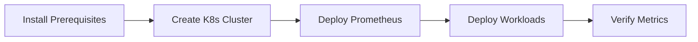
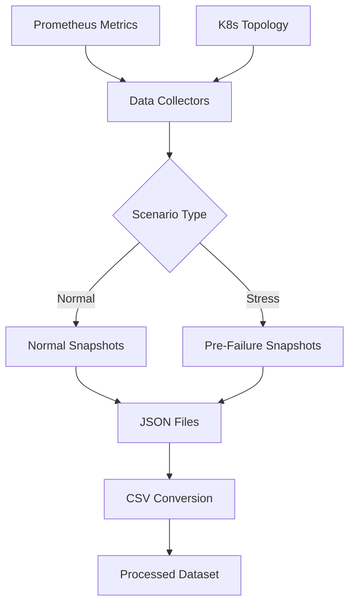
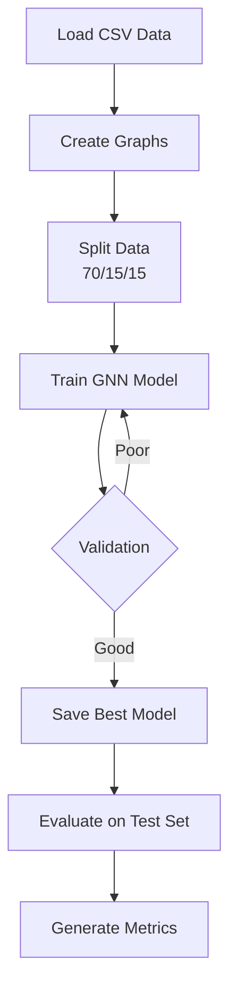
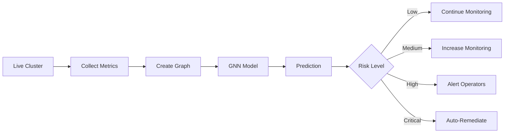

# Kubernetes Failure Prevention using Graph Neural Networks (GNN)

A machine learning system that predicts failures in Kubernetes clusters by analyzing cluster topology and resource metrics as graph structures using Graph Neural Networks.

---

## Table of Contents

- [Overview](#overview)
- [System Architecture](#system-architecture)
- [Complete Workflow](#complete-workflow)
- [Quick Start](#quick-start)
- [Prerequisites](#prerequisites)
- [Setup Instructions](#setup-instructions)
- [Data Collection](#data-collection)
- [Model Training](#model-training)
- [Deployment](#deployment)
- [Documentation](#documentation)

---

## Overview

This project implements an end-to-end machine learning pipeline for predicting failures in Kubernetes clusters before they occur. By representing the cluster as a graph (pods and nodes as vertices, scheduling relationships as edges) and using Graph Neural Networks, the system can learn complex patterns that indicate impending failures.

---

## System Architecture

```
┌─────────────────────────────────────────────────────────────────────┐
│                        Kubernetes Cluster                            │
│  ┌──────────┐  ┌──────────┐  ┌──────────┐  ┌──────────┐           │
│  │   Pod    │  │   Pod    │  │   Pod    │  │   Pod    │           │
│  │ Frontend │  │ Backend  │  │  Redis   │  │ Workload │           │
│  └────┬─────┘  └────┬─────┘  └────┬─────┘  └────┬─────┘           │
│       │             │              │             │                  │
│  ┌────┴─────────────┴──────────────┴─────────────┴─────┐           │
│  │              Node (minikube/kind)                    │           │
│  └──────────────────────────────────────────────────────┘           │
│                              │                                       │
│                    ┌─────────▼─────────┐                            │
│                    │   Prometheus      │                            │
│                    │  (Metrics Server) │                            │
│                    └─────────┬─────────┘                            │
└──────────────────────────────┼──────────────────────────────────────┘
                               │
                    ┌──────────▼──────────┐
                    │  Data Collectors    │
                    │  - PrometheusCollector
                    │  - K8sCollector     │
                    └──────────┬──────────┘
                               │
                    ┌──────────▼──────────┐
                    │   Data Storage      │
                    │  - JSON Snapshots   │
                    │  - CSV Features     │
                    └──────────┬──────────┘
                               │
                    ┌──────────▼──────────┐
                    │  Data Processing    │
                    │  - JSON→CSV Convert │
                    │  - Feature Extract  │
                    │  - Normalization    │
                    └──────────┬──────────┘
                               │
                    ┌──────────▼──────────┐
                    │   GNN Model         │
                    │  - Graph Attention  │
                    │  - Temporal Learn   │
                    │  - Classification   │
                    └──────────┬──────────┘
                               │
                    ┌──────────▼──────────┐
                    │   Predictions       │
                    │  - Normal/Failure   │
                    │  - Confidence Score │
                    │  - Risk Level       │
                    └──────────┬──────────┘
                               │
                    ┌──────────▼──────────┐
                    │   Actions           │
                    │  - Alerts           │
                    │  - Auto-scaling     │
                    │  - Remediation      │
                    └─────────────────────┘
```

---

## 🔄 Complete Workflow

### Phase 1: Infrastructure Setup



**Steps**:
1. Install kind/minikube, kubectl
2. Create Kubernetes cluster
3. Deploy Prometheus for monitoring
4. Deploy sample workloads (frontend, backend, redis)
5. Verify metrics collection

### Phase 2: Data Collection



**Steps**:
1. **Normal Data Collection** (Target: 1,500 snapshots)
   - Run cluster under normal load
   - Collect every 30-60 seconds
   - No chaos experiments
   - CPU: 20-60%, stable memory

2. **Stress Data Collection** (Already have: 1,587 snapshots)
   - Inject chaos (CPU stress, memory pressure, pod kills)
   - Collect every 10-30 seconds
   - Capture pre-failure states

3. **Data Conversion**
   - Convert JSON → CSV format
   - Extract node features, edges, graph metrics
   - Normalize and scale features

### Phase 3: Model Training



**Steps**:
1. Load processed CSV data
2. Convert to PyTorch Geometric graphs
3. Split into train/val/test (70/15/15)
4. Train GNN with:
   - 3 GAT layers
   - Focal loss for imbalance
   - Early stopping
5. Evaluate and save best model

### Phase 4: Deployment & Inference



**Steps**:
1. Load trained model
2. Collect real-time metrics
3. Make predictions every 30s
4. Assess risk level
5. Take appropriate actions

---

## Quick Start

### 1. Clone and Setup

```bash
git clone <repository-url>
cd k8s-failure-prevention-gnn

# Create virtual environment
python3 -m venv venv
source venv/bin/activate

# Install dependencies
pip install -r requirements.txt
```

### 2. Setup Kubernetes Cluster

```bash
# Create cluster
kind create cluster --config cluster-config.yaml --name gnn-cluster

# Verify
kubectl get nodes
```

### 3. Deploy Prometheus

```bash
# Create monitoring namespace
kubectl create namespace monitoring

# Deploy Prometheus
kubectl apply -f k8s-manifests/prometheus/

# Port-forward
kubectl port-forward deploy/prometheus-deployment 9090:9090 -n monitoring
```

### 4. Deploy Workloads

```bash
# Deploy sample applications
kubectl apply -f k8s-manifests/workload.yaml

# Verify
kubectl get pods -n workload
```

### 5. Collect Data

```bash
# Collect normal scenarios (run for 18-21 hours)
./scripts/collect_normal_data.sh

# Or use Python script for direct CSV output
python3 scripts/collect_normal_data_csv.py
```

### 6. Train Model

```bash
# Convert JSON to CSV (if using shell script)
python scripts/convert_json_to_csv.py

# Train GNN model
cd models
python train.py
```

### 7. Make Predictions

```bash
# Real-time inference
python inference.py
```

---

## Prerequisites

### Software Requirements

- **Python**: 3.9+
- **Docker**: 20.10+
- **kubectl**: 1.27+
- **kind** or **minikube**: Latest version

### Hardware Requirements

- **CPU**: 4+ cores recommended
- **RAM**: 8GB minimum, 16GB recommended
- **Disk**: 20GB free space
- **GPU**: Optional (5-6x faster training)

### Python Dependencies

See `requirements.txt`:
- PyTorch >= 2.0.0
- PyTorch Geometric >= 2.3.0
- pandas, numpy, scikit-learn
- matplotlib, seaborn
- kubernetes, prometheus-client

---

## 🔧 Setup Instructions

### Install kind

```bash
curl -Lo ./kind https://kind.sigs.k8s.io/dl/v0.20.0/kind-linux-amd64
chmod +x ./kind
sudo mv ./kind /usr/local/bin/kind
```

### Install kubectl

```bash
curl -LO "https://dl.k8s.io/release/$(curl -L -s https://dl.k8s.io/release/stable.txt)/bin/linux/amd64/kubectl"
chmod +x kubectl
sudo mv kubectl /usr/local/bin/
```

### Create Cluster

```bash
kind create cluster --config cluster-config.yaml --name gnn-cluster
```

### Verify Nodes

```bash
kubectl get nodes
```

### Check Cluster Info

```bash
kubectl cluster-info --context kind-gnn-cluster
```

### Verify Control Plane Components

```bash
kubectl get pods -n kube-system
```

---

## Data Collection

### Current Status

- **Normal scenarios**: 99 (5.9%) ❌
- **Stress scenarios**: 1,587 (94.1%) ✅
- **Target**: 40-50% normal, 50-60% stress

### Collection Methods

#### Method 1: Automated Shell Script

```bash
./scripts/collect_normal_data.sh
```

**Features**:
- Pre-flight checks
- Automatic health monitoring
- Progress tracking with ETA
- Graceful interruption

#### Method 2: Direct CSV Collection

```bash
python3 scripts/collect_normal_data_csv.py
```

**Features**:
- Writes directly to CSV
- No conversion needed
- More efficient

### Data Format

**Node Features** (`node_features.csv`):
- snapshot_id, node_id, node_type
- cpu_usage, memory_usage_mb, restart_count
- status, namespace, assigned_node

**Edge Features** (`edge_features.csv`):
- snapshot_id, source_node, target_node
- edge_type, weight

**Graph Features** (`graph_features.csv`):
- Aggregated metrics per snapshot
- 19 features including CPU, memory, API latency
- Label (0=normal, 1=pre_failure)

---

## Model Training

### Architecture

- **Input**: Graph with node features and edges
- **Layers**: 3 GAT layers with 4 attention heads
- **Pooling**: Mean + Max graph-level pooling
- **Output**: Binary classification (Normal/Pre-Failure)

### Training Configuration

```python
config = {
    'hidden_dim': 128,
    'num_gat_layers': 3,
    'num_heads': 4,
    'dropout': 0.3,
    'learning_rate': 0.001,
    'batch_size': 32,
    'epochs': 100,
    'use_focal_loss': True,
    'early_stopping_patience': 15
}
```

### Train Model

```bash
cd models
python train.py
```

### Expected Performance

With balanced data:
- **Accuracy**: >85-90%
- **F1 Score**: >85-90%
- **ROC-AUC**: >0.85-0.90

### Training Time

- **GPU**: ~5-10 minutes
- **CPU**: ~30-60 minutes

---

## Deployment

### Load Trained Model

```python
from models.inference import FailurePredictor

predictor = FailurePredictor(
    model_path='outputs/best_model.pt',
    scalers_path='outputs/scalers.pkl'
)
```

### Real-Time Monitoring

```python
from src.collectors.prometheus_collector import PrometheusCollector
from src.collectors.k8s_collector import K8sCollector
import time

prom = PrometheusCollector()
k8s = K8sCollector()

while True:
    # Collect current state
    metrics = prom.collect_snapshot()
    topology = k8s.collect_topology()
    
    # Predict
    prediction = predictor.predict_from_snapshot(metrics, topology)
    
    # Take action based on risk
    if prediction['risk_level'] in ['high', 'critical']:
        print(f"⚠️  WARNING: {prediction['risk_level']} risk!")
        print(f"   Failure probability: {prediction['probabilities']['pre_failure']:.2%}")
        # Alert operators, scale resources, etc.
    
    time.sleep(30)
```

### Risk Levels

| Level | Probability | Action |
|-------|-------------|--------|
| **Low** | < 30% | Normal monitoring |
| **Medium** | 30-50% | Increased monitoring |
| **High** | 50-70% | Alert operators |
| **Critical** | > 70% | Immediate action |

---

## Documentation

### Main Documentation

- **[README_DATA_COLLECTION.md](README_DATA_COLLECTION.md)** - Data collection guide
- **[README_GNN_MODEL.md](README_GNN_MODEL.md)** - Model architecture and training
- **[docs/DATA_COLLECTION_STRATEGY.md](docs/DATA_COLLECTION_STRATEGY.md)** - Detailed data strategy
- **[docs/NORMAL_DATA_COLLECTION_GUIDE.md](docs/NORMAL_DATA_COLLECTION_GUIDE.md)** - Normal data collection
- **[docs/DATA_CONVERSION_SUMMARY.md](docs/DATA_CONVERSION_SUMMARY.md)** - Conversion results

### Code Documentation

- **models/gnn_model.py** - GNN architecture
- **models/dataset.py** - Data loading
- **models/train.py** - Training pipeline
- **models/inference.py** - Real-time inference
- **scripts/convert_json_to_csv.py** - Data conversion
- **scripts/collect_normal_data.sh** - Automated collection

---

## Project Status

### Completed

- [x] Kubernetes cluster setup
- [x] Prometheus monitoring deployment
- [x] Data collection infrastructure
- [x] JSON to CSV conversion pipeline
- [x] GNN model implementation
- [x] Training pipeline with validation
- [x] Inference system for predictions
- [x] Comprehensive documentation

### In Progress

- [x] Collect balanced normal data (1,500 snapshots needed)
- [x] Train model on balanced dataset
- [ ] Deploy for real-time monitoring

### 📋 TODO

- [ ] Implement automated remediation
- [ ] Add support for multi-class classification
- [ ] Create web dashboard for monitoring
- [ ] Add model explainability features
- [ ] Implement continuous learning pipeline

---

## Contributing

Contributions are welcome! Please:

1. Fork the repository
2. Create a feature branch
3. Make your changes
4. Submit a pull request

---

## 🙏 Acknowledgments

- PyTorch Geometric team for the GNN framework
- Kubernetes community for excellent documentation
- Prometheus for metrics collection

---

## 📞 Support

For issues or questions:
1. Check documentation in `docs/`
2. Review troubleshooting sections
3. Open an issue on GitHub

---

## 🎯 Next Steps

1. **Collect Balanced Data**
   ```bash
   ./scripts/collect_normal_data.sh
   ```

2. **Train Model**
   ```bash
   cd models && python train.py
   ```

3. **Deploy for Monitoring**
   ```bash
   python models/inference.py
   ```

**Remember**: Model quality depends on data quality. Collect balanced, high-quality training data!
